# ECGBench — Architecture & Main Flow

This document explains how ECGBench works end to end, using Mermaid diagrams.
Every box names a real function, class, or dataclass so the diagrams double as a
map into the source. Diagrams progress from the big picture down to each
subsystem's internal call flow.

> **How to read these:** rounded boxes are *functions*, rectangles are *modules /
> data*, diamonds are *decisions*, and `((...))` are *external libraries*.
> Function names match the source exactly (e.g. `validate_dataset`,
> `split_dataset`, `export_splits`).

---

## 1. System Overview — the four subsystems

ECGBench is config-driven: one YAML file per dataset feeds every subsystem.
There are two distinct user journeys — **building** a benchmark (`ecgbench
splits`) and **consuming** one (`ECGDataset` in a training loop).

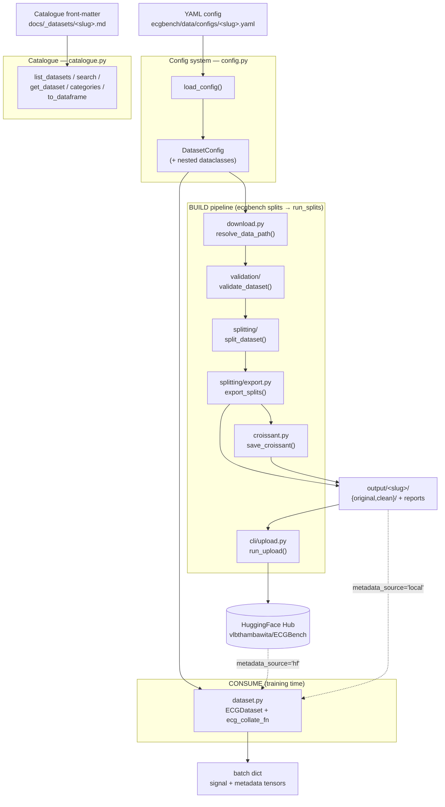

---

## 2. The main BUILD flow — `run_splits()`

`run_splits()` (in `cli/splits.py`, also exposed as `ecgbench.run_splits` and the
`ecgbench splits` CLI command) is the orchestrator that chains every build
subsystem together. This is the single most important flow in the library.

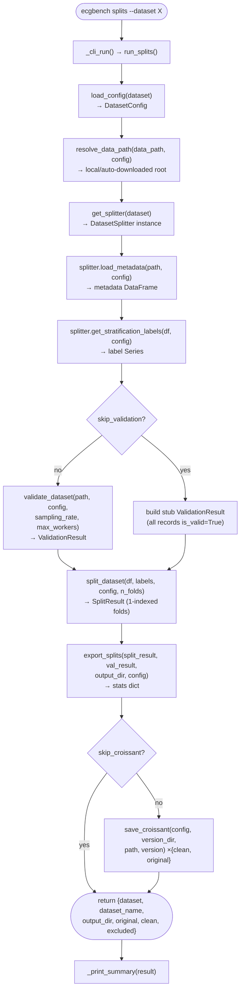

**Key sequence (who calls whom, with the data passed):**

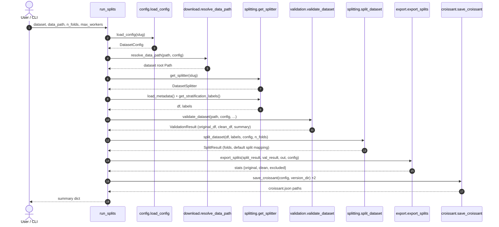

---

## 3. Config system — `load_config()`

A YAML file is parsed by a set of `_parse_*` helpers into one typed
`DatasetConfig` (with nested dataclasses). Required fields are validated before
construction.

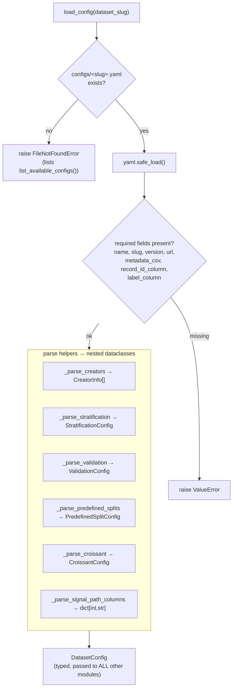

**Config dataclass model** (`config.py`):

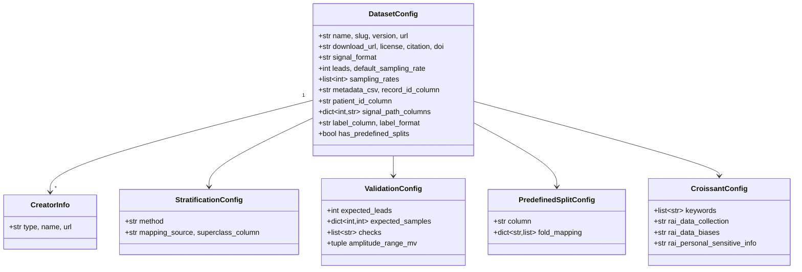

---

## 4. Validation engine — `validate_dataset()`

Reads the metadata CSV, loads each signal file, and runs the configured quality
checks **in parallel** via `ProcessPoolExecutor`. Produces both an `original_df`
(all records + flags) and a `clean_df` (valid only).

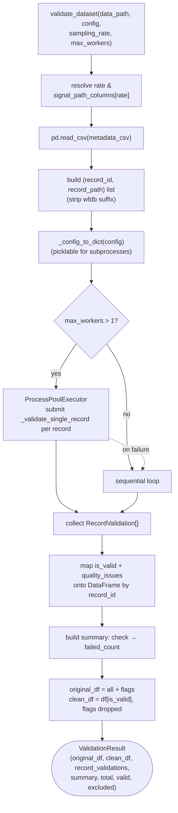

**Per-record check dispatch** — `_validate_single_record()` → `CHECK_REGISTRY`:

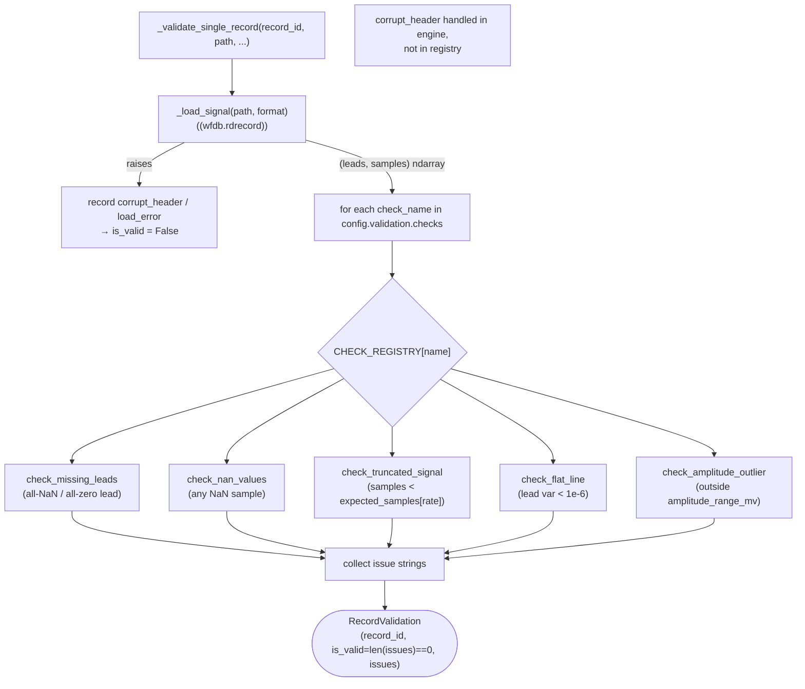

The report side: `generate_report()` / `save_report()` (in `validation/report.py`)
turn a `ValidationResult` into `validation_report.json` with per-check stats and
the full excluded-records list.

---

## 5. Splitting framework — `split_dataset()` + strategies

Two pieces: a **strategy** (how to load metadata & derive stratification labels,
dataset-specific) and the **engine** (how to assign folds, universal). The
registry picks the strategy; `GenericSplitter` is the config-only fallback.

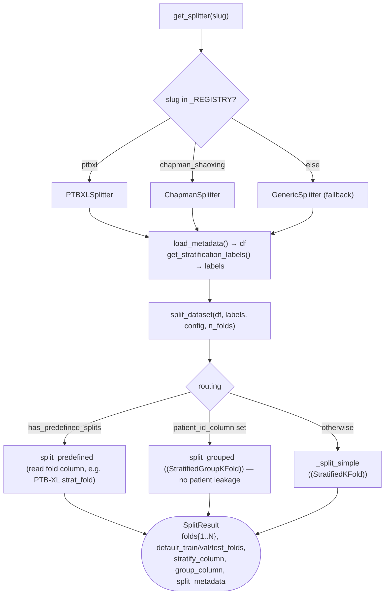

**Strategy class hierarchy** (`splitting/base.py` + `strategies/`):

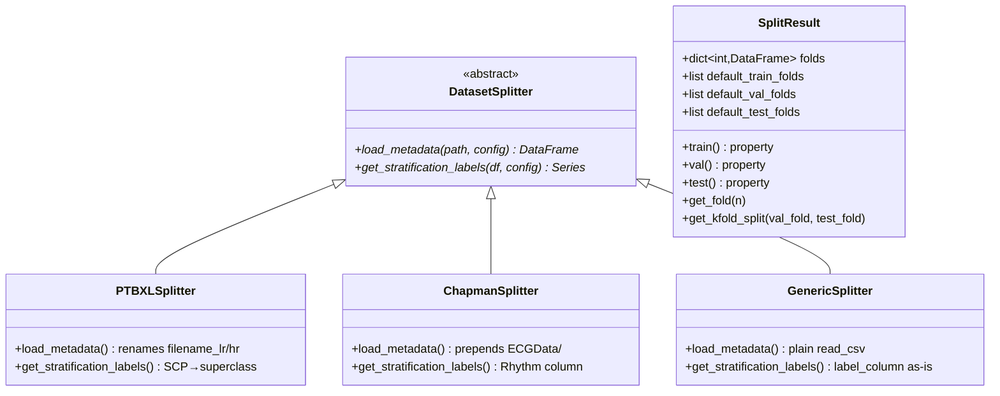

PTB-XL's stratification detail — `get_stratification_labels()` maps SCP codes to
diagnostic superclasses (`NORM, MI, STTC, HYP, CD`):

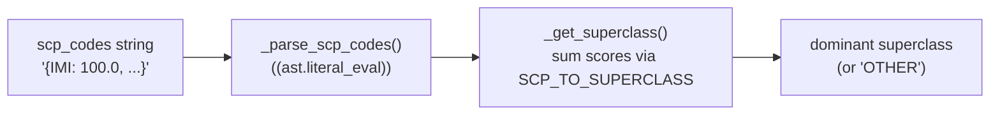

---

## 6. Export — `export_splits()`

Writes **minimal-column** fold CSVs for both `original/` (with quality flags) and
`clean/` (valid only) versions, plus the validation report. Full metadata stays
in the source CSV; users join on `record_id`.

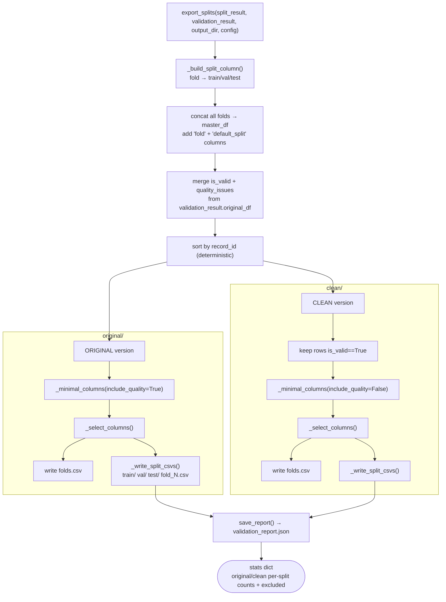

**Resulting on-disk layout:**

```
output/<slug>/
├── original/
│   ├── folds.csv
│   ├── train/fold_1.csv … fold_8.csv
│   ├── val/fold_9.csv
│   ├── test/fold_10.csv
│   └── croissant.json
├── clean/
│   ├── folds.csv
│   ├── train/ val/ test/ …
│   └── croissant.json
└── validation_report.json
```

---

## 7. Croissant metadata — `save_croissant()`

Generates MLCommons Croissant 1.1 JSON-LD describing every CSV (with SHA-256
hashes) and the train/val/test record sets. Uses `mlcroissant` if available, with
a hand-built JSON-LD fallback.

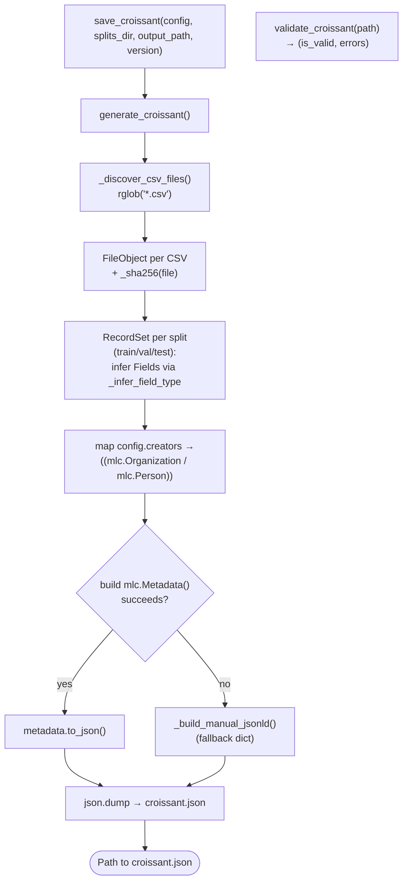

---

## 8. Consuming a benchmark — `ECGDataset` at training time

The consumer side. `ECGDataset` reads fold CSVs (from HuggingFace Hub by default,
or local disk) to know *which* records belong to a split, then lazily loads each
signal file on `__getitem__`. `ecg_collate_fn` batches heterogeneous samples.

Two selection axes, independent of each other:

- **Which records.** `fold_numbers` narrows a split to specific folds. Because each
  fold was exported under exactly one split, `split=None` + `fold_numbers` is the
  only way to select folds across split boundaries (custom cross-validation); it
  routes through `folds.csv` and `_filter_master()` rather than the per-split files.
- **Which samples.** `window=(start, length)` is pushed into the reader —
  `sampfrom`/`sampto` for wfdb, `skiprows`/`max_rows` for csv — so the discarded
  samples are never decoded. Together with `leads=`, `units=` and `transform=` these
  are read-time adapters: they shape the returned tensor and never affect the source
  files, the fold CSVs, or validation. Note `validation/engine.py` keeps its own
  window-less copy of `_load_signal`, because validation must always see whole
  records.

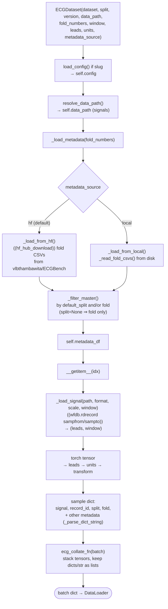

**DataLoader sequence:**

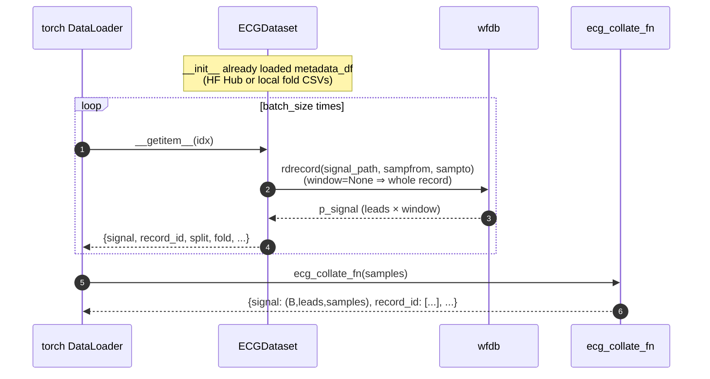

---

## 9. Download resolution — `resolve_data_path()`

The single entry point all modules use to locate signal files. Returns a local
path, the cache, or triggers an auto-download.

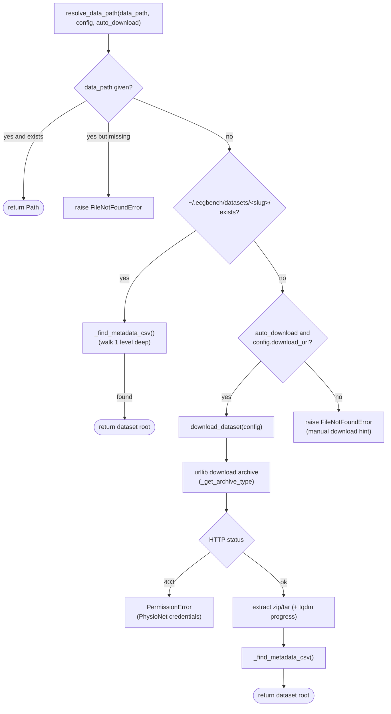

---

## 10. Catalogue & public API surface

The **catalogue** is independent of the heavy pipeline — pure metadata, always
importable. The package uses **lazy imports** (`__getattr__` in `__init__.py`) so
`import ecgbench` never pulls in torch / wfdb / mlcroissant.

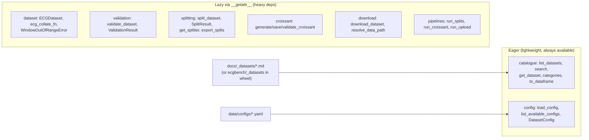

**CLI dispatch** (`cli/_main.py` → `ecgbench` console script):

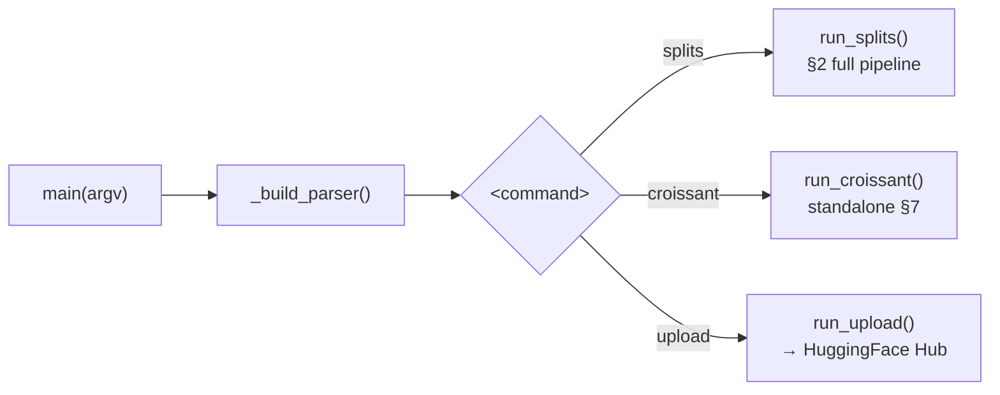

`run_upload()` walks `output/<slug>/{original,clean}/**.csv` plus
`validation_report.json` / `croissant.json`, resolves an HF token
(arg → `HF_TOKEN` → `HUGGINGFACE_HUB_TOKEN` → `.env`), and pushes each file via
`HfApi.upload_file` (or lists them under `--dry-run`).

---

## Function index (quick reference)

| Subsystem | Module | Key functions / classes |
|---|---|---|
| Config | `config.py` | `load_config`, `list_available_configs`, `DatasetConfig`, `CreatorInfo`, `StratificationConfig`, `ValidationConfig`, `PredefinedSplitConfig`, `CroissantConfig` |
| Catalogue | `catalogue.py` | `list_datasets`, `search`, `get_dataset`, `categories`, `to_dataframe`, `CatalogueEntry` |
| Download | `download.py` | `resolve_data_path`, `download_dataset`, `_find_metadata_csv`, `_get_archive_type` |
| Validation | `validation/engine.py` | `validate_dataset`, `_validate_single_record`, `_load_signal`, `_config_to_dict`, `ValidationResult`, `RecordValidation` |
| Validation | `validation/checks.py` | `check_missing_leads`, `check_nan_values`, `check_truncated_signal`, `check_flat_line`, `check_amplitude_outlier`, `CHECK_REGISTRY` |
| Validation | `validation/report.py` | `generate_report`, `save_report` |
| Splitting | `splitting/engine.py` | `split_dataset`, `_split_predefined`, `_split_grouped`, `_split_simple` |
| Splitting | `splitting/base.py` | `DatasetSplitter` (ABC), `SplitResult` |
| Splitting | `splitting/registry.py` | `register`, `get_splitter` |
| Splitting | `strategies/` | `PTBXLSplitter`, `ChapmanSplitter`, `GenericSplitter`, `_get_superclass`, `_parse_scp_codes` |
| Splitting | `splitting/export.py` | `export_splits`, `_minimal_columns`, `_select_columns`, `_build_split_column`, `_write_split_csvs` |
| Croissant | `croissant.py` | `generate_croissant`, `save_croissant`, `validate_croissant`, `_build_manual_jsonld`, `_discover_csv_files`, `_sha256`, `_infer_field_type` |
| Dataset | `dataset.py` | `ECGDataset` (`_load_metadata`, `_load_from_hf`, `_load_from_local`, `_read_fold_csvs`, `_filter_master`, `__getitem__`), `ecg_collate_fn`, `_load_signal`, `_resolve_window`, `_resolve_leads`, `_resolve_units`, `WindowOutOfRangeError`, `_parse_dict_string` |
| Pipelines / CLI | `cli/` | `run_splits`, `run_croissant`, `run_upload`, `main`, `_build_parser` |
| Public API | `__init__.py` | eager catalogue+config; lazy `__getattr__` for everything else |
